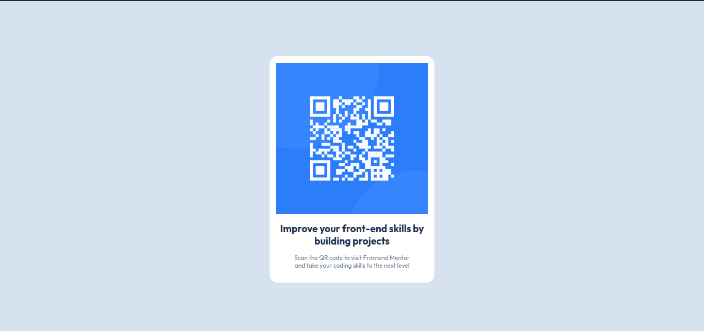

# Frontend Mentor - QR code component solution

This is a solution to the [QR code component challenge on Frontend Mentor](https://www.frontendmentor.io/challenges/qr-code-component-iux_sIO_H). Frontend Mentor challenges help you improve your coding skills by building realistic projects.

## Table of contents

- [Overview](#overview)
  - [Screenshot](#screenshot)
  - [Links](#links)
- [My process](#my-process)
  - [Built with](#built-with)
  - [What I learned](#what-i-learned)
  - [Continued development](#continued-development)
  - [Useful resources](#useful-resources)
- [Author](#author)


## Overview

### Screenshot




### Links

- Solution URL: [Solution](https://rajin-siam.github.io/QR-code-component/)
- Live Site URL: [Live Site](https://rajin-siam.github.io/QR-code-component/)

## My process

### Built with

- Semantic HTML5 markup
- CSS custom properties
- Mobile-first workflow

### What I learned

I learned how to integrade css in HTML docs. This project gave me an insight about using box model. I can integrade various font style in my project. It also gave an idea about how to create mobile resposive web design.

To see how you can add code snippets, see below:

```css
@import url('https://fonts.googleapis.com/css2?family=Outfit:wght@400;700&display=swap');
```


Resetting CSS involves using a CSS reset to neutralize or "reset" the default styles applied by web browsers. 
```
*{
  
    font-family: 'Outfit', sans-serif;
    margin: 0;/*    reseting css   */
    padding: 0;
    box-sizing: border-box;
}
```

:root is a special CSS pseudo-class that represents the root element of the document.

In HTML documents, the root element is always the <html> element.
Using :root is similar to selecting the <html> tag in CSS, but it has higher specificity and is better suited for defining global styles like CSS variables.

CSS variables :CSS variables, also called custom properties, are reusable values defined in CSS. They start with a double dash (--) and can store values like colors, sizes, or any CSS property. 

```:root {
  
    --white: hsl(0, 0%, 100%);/*  CSS varialbles  */
    --light-gray: hsl(212, 45%, 89%);
    --grayish-blue: hsl(216, 15%, 48%);
    --dark-blue: hsl(218, 44%, 22%);

}
```


### Continued development

We can upgrade this project to next level by generating QR code on server side. Until now we are just using the same image. If we generate dynamic qr code we can add many functionalities and info inside qr code

### Useful resources

- [CSS Box Model](https://www.geeksforgeeks.org/css-box-model/) - This helped me for Box Model.


## Author

- Website - [Md. Rajin Mashrur Siam](https://rajin-siam.github.io/Portfolio/)
- Frontend Mentor - [@rajin-siam](https://www.frontendmentor.io/profile/yourusername)
- LinkedIn - [md-rajin-mashrur-siam](https://www.linkedin.com/in/md-rajin-mashrur-siam/)


